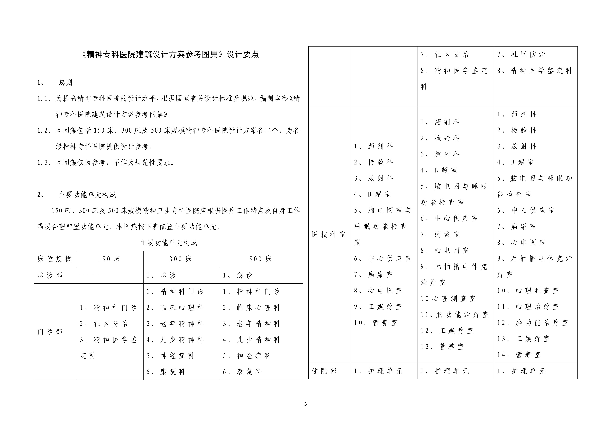
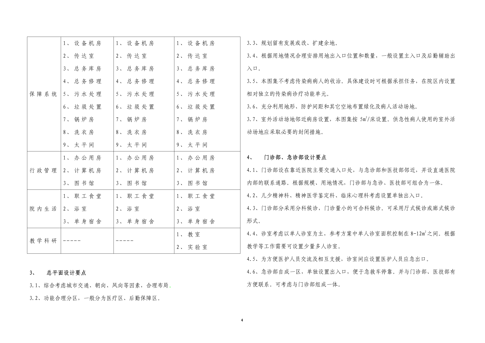
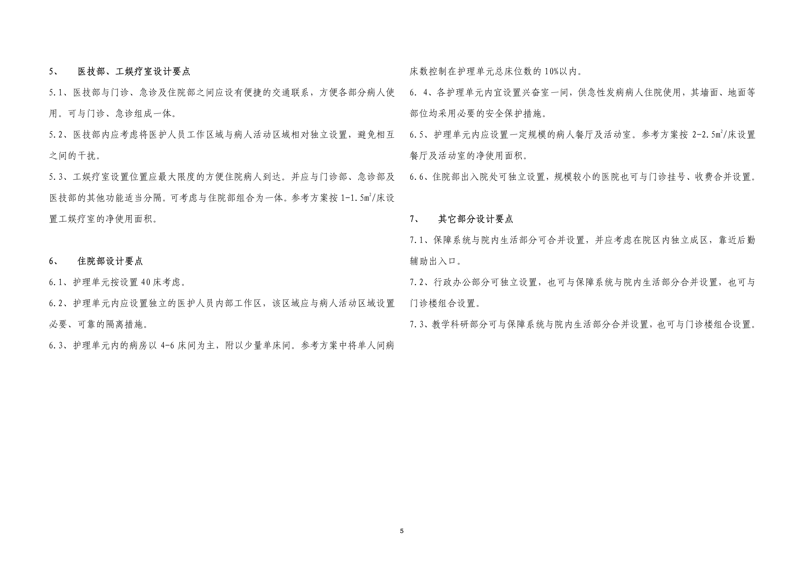
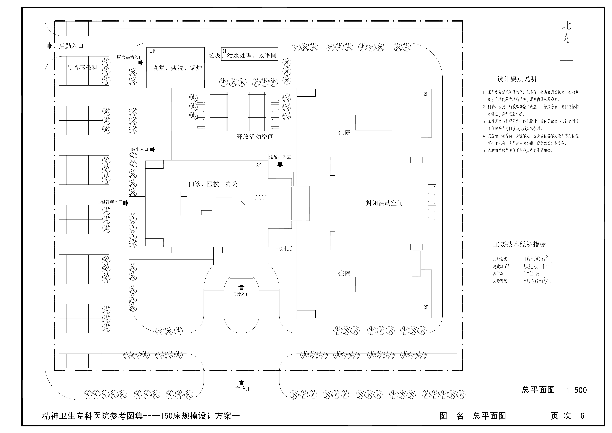
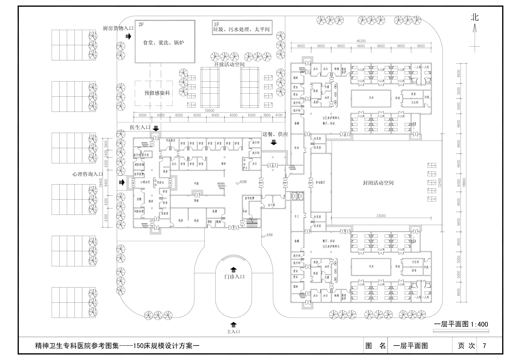
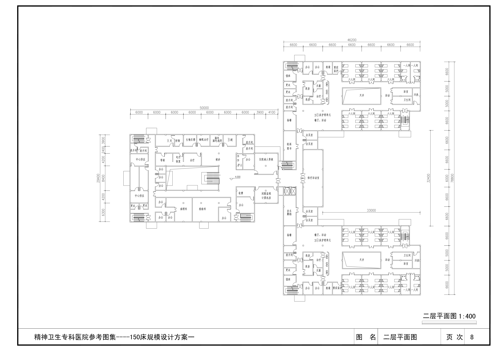
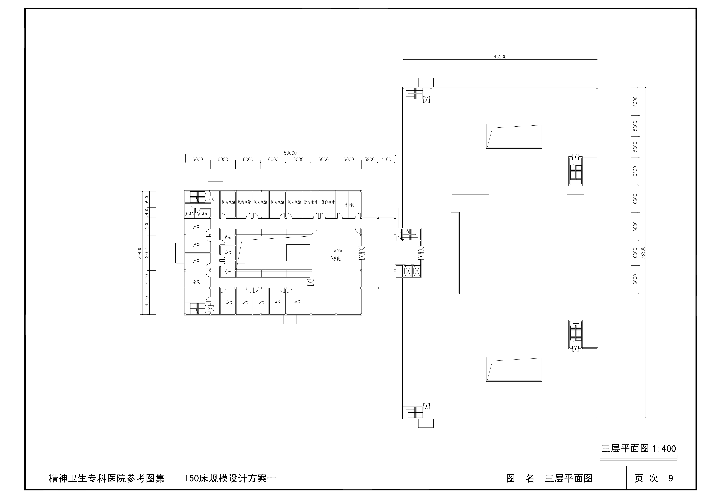
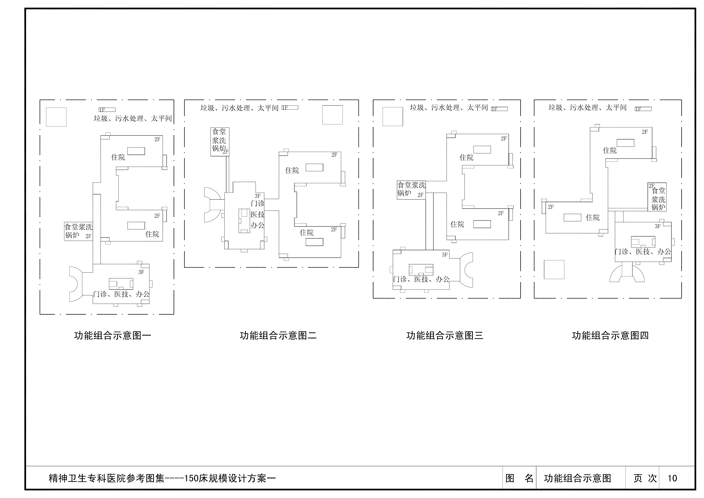

# 精神专科医院 — 3D 建模设计文档

> 基于《精神专科医院建筑设计方案参考图集》（卫生部，2009.12）
> 图纸为 300 床规模设计方案（8 层主楼 + 地下 1 层）
> 游戏项目：`面具`

---

## 一、图纸来源与范围

| 项目 | 说明 |
|------|------|
| 来源 | 《精神专科医院建筑设计方案参考图集》 |
| 编制 | 卫生部组织，中国中元国际工程公司等 |
| 规模 | **300 床**（最适合游戏的中等规模） |
| 层数 | 地下 1 层 + 地上 8 层 + 设备层 |
| 结构 | 框架结构，主楼 + 裙房布局 |

---

## 二、建筑整体概况

```
屋顶层     ████████
设备层     ████████
八层(F8)   ████████  标准护理单元
七层(F7)   ████████  标准护理单元
六层(F6)   ████████  标准护理单元
五层(F5)   ████████  标准护理单元
四层(F4)   ████████  护理单元
三层(F3)   ████████  护理单元 + 工娱疗室
二层(F2)   ████████  医技 + 行政
首层(F1)   ██████████  门诊大厅 + 急诊 + 药房 (含裙房)
地下一层(B1) ████████  设备 + 库房 + 太平间
```

### 建筑尺寸（估算）

- 主楼面宽：约 **55m**
- 主楼进深：约 **18m**
- 裙房进深：约 **25m**
- 层高：约 **3.6-3.9m**（首层 4.2m）
- 总建筑高度：约 **35m**

---

## 三、各层平面分析与游戏空间映射

### B1 — 地下一层

| 图纸 | 文件 |
|------|------|
|  | `平面图/01-地下一层.png` |

**功能区域：**
- 设备机房（配电、空调、水泵）
- 总务库房
- 洗衣房
- 太平间 ⚰️
- 污水处理

**游戏用途：**
- 🎮 **恐怖氛围区 / 隐藏区域**
- 太平间 → 适合放置特殊事件或隐藏剧情
- 设备管道 → 密道、隐藏通路
- 昏暗、潮湿、机械噪音 → 压迫感场景

---

### F1 — 首层（门诊大厅）

| 图纸 | 文件 |
|------|------|
|  | `平面图/02-首层.png` |

**功能区域：**
- 门诊大厅（挑空中庭）
- 挂号收费
- 药房（药剂科）
- 急诊部（独立入口）
- 精神科诊室
- 临床心理科
- 候诊区

**游戏用途：**
- 🎮 **入口 / 安全区 / 镜子房间**
- 门诊大厅的挑空中庭 → 气势恢宏的入口，可作为"镜子房间"的理想位置
- 挂号处 → 游戏开局/存档点
- 诊室 → 角色初始病房或剧情触发点
- 急诊独立入口 → 可设计为特殊事件的侵入点

---

### F2 — 二层（医技层）

| 图纸 | 文件 |
|------|------|
|  | `平面图/03-二层.png` |

**功能区域：**
- 检验科
- 放射科（X 光、CT）
- B 超室
- 心电图室
- 脑电图与睡眠功能检查室
- 心理测查室
- 心理治疗室
- 脑功能治疗室
- 行政办公

**游戏用途：**
- 🎮 **医技探索区 / 解谜区**
- 放射科 → 观察者效应的绝佳隐喻场所（"被看见" = 被 X 光照射）
- 脑电图室 → 可与 SAN 值机制关联，监测精神状态的设备
- 心理测查室 → 玩家能力测试/升级空间
- 睡眠检查室 → 梦境关卡入口

---

### F3 — 三层（护理单元 + 工娱疗室）

| 图纸 | 文件 |
|------|------|
|  | `平面图/04-三层.png` |

**功能区域：**
- 护理单元（40 床/单元）
- 工娱疗室（手工、音乐、绘画治疗）
- 病人餐厅
- 活动室
- 兴奋室（隔离室）

**游戏用途：**
- 🎮 **核心游戏区 / 病房区**
- 工娱疗室 → 态度卡牌的训练/获取场所
- 兴奋室 → 特殊战斗房间（隔离的狂暴敌人）
- 活动室 → NPC 聚集区、支线任务
- 病人餐厅 → 社交/情报交换

---

### F4 — 四层（护理单元）

| 图纸 | 文件 |
|------|------|
|  | `平面图/05-四层.png` |

**功能区域：**
- 护理单元 × 2
- 4-6 人间病房为主
- 少量单人间
- 医护人员工作站（独立隔离区）

**游戏用途：**
- 🎮 **病房区 / 战斗区**
- 多人病房 → 群体战斗场景（多个病人同时出现症状）
- 单人间 → Boss 战或关键 NPC 房间
- 医护工作站隔离门 → 门禁机制，需要特定条件解锁

---

### F5-F8 — 五至八层（标准护理单元）

| 图纸 | 文件 |
|------|------|
|  | `平面图/06-五至八层.png` |

**功能区域：**
- 标准护理单元（每层 2 个单元 × 40 床）
- 病房、活动室、餐厅
- 医护人员工作区

**游戏用途：**
- 🎮 **深度探索区 / 难度递增**
- 越往上，病情越重 → 游戏难度递增
- F8 顶层 → 最终 Boss 区或终极真相
- 可设计为：每层解锁需要特定条件（SAN 值、态度组合）

---

### 设备层 + 屋顶

| 图纸 | 文件 |
|------|------|
|  | `平面图/07-机房设备层.png` |
|  | `平面图/08-屋顶层.png` |

**游戏用途：**
- 🎮 **终局区域**
- 屋顶 → 最终 Boss 战场地、主角觉醒/崩溃场景
- 设备层 → 建筑"心脏"，可能是观察者效应源头的物理化身
- 开阔天空 vs 封闭病房 → 叙事高潮的视觉反差

---

## 四、立面分析 — 建筑外观

| 朝向 | 文件 |
|------|------|
| 南立面（主入口） | `立面图/01-南立面.png` |
| 北立面（背面） | `立面图/02-北立面.png` |
| 东立面 | `立面图/03-东立面.png` |
| 西立面 | `立面图/04-西立面.png` |

**外观特征：**
- 现代主义风格，简洁方正
- 规则矩形窗阵 → 重复、规训、制度化的视觉隐喻
- 主入口挑檐 → 可设计为"吞噬感"的入口
- 裙房低矮 + 主楼高耸 → 压迫与渺小

---

## 五、与游戏机制的对接

### 关键空间 → 游戏功能映射

| 真实功能 | 游戏化 | 映射机制 |
|----------|--------|----------|
| 门诊大厅 | **镜子房间** | 开局、构筑、收束 |
| 诊室 | 角色初始点 | 面具选择 |
| 脑电图室 | SAN 值监测站 | 精神状态可视化 |
| 放射科 | 观察者效应枢纽 | "被看见"的具象化 |
| 兴奋室 | 隔离战斗房 | 单独 Boss 战 |
| 工娱疗室 | 态度训练场 | 卡牌获取/升级 |
| 病房（多人间） | 群体战斗 | 多敌人同屏 |
| 病房（单人间） | 关键 NPC/Boss | 剧情节点 |
| 太平间 | 隐藏区域 | 特殊事件/秘密 |
| 屋顶 | 终局战场 | 最终 Boss/结局 |
| 设备层 | 真相层 | 观察者效应源头 |

---

## 六、建模优先级

### Phase 1 — 核心骨架（先做）
1. **F1 首层** — 门诊大厅 + 镜子房间（最核心的游戏空间）
2. **标准护理单元** — F4 一层作为模板，F5-F8 复用
3. **走廊系统** — 所有连接通道

### Phase 2 — 游戏必需（第二）
4. F2 医技层（脑电图、放射科）
5. F3 工娱疗室
6. B1 太平间

### Phase 3 — 收尾（第三）
7. 立面外观
8. 设备层 + 屋顶
9. 室外庭院（病人活动场地）

---

## 七、美术风格方向（讨论）

基于游戏世界观（月光、量子叠加、观察者效应），建筑风格可考虑：

- **白天**：冷峻、干净、制度化的现代医院
- **月光下**：建筑扭曲、走廊延伸、房间重组
- **材质基调**：白色瓷砖 + 混凝土 + 不锈钢 → 冰冷感
- **关键元素**：镜子（无处不在）、月光窗影、老式医疗设备

---

## 八、文件组织

```
治疗中心建模/
├── 00-建模设计文档.md     ← 本文件
├── 平面图/
│   ├── 01-地下一层.png
│   ├── 02-首层.png
│   ├── 03-二层.png
│   ├── 04-三层.png
│   ├── 05-四层.png
│   ├── 06-五至八层.png
│   ├── 07-机房设备层.png
│   └── 08-屋顶层.png
├── 立面图/
│   ├── 01-南立面.png
│   ├── 02-北立面.png
│   ├── 03-东立面.png
│   ├── 04-西立面.png
│   └── 05-06-立面补充.png
└── 参考图/
    ├── 00-图纸目录与总说明.png
    └── 01-04-剖面与详图.png
```
